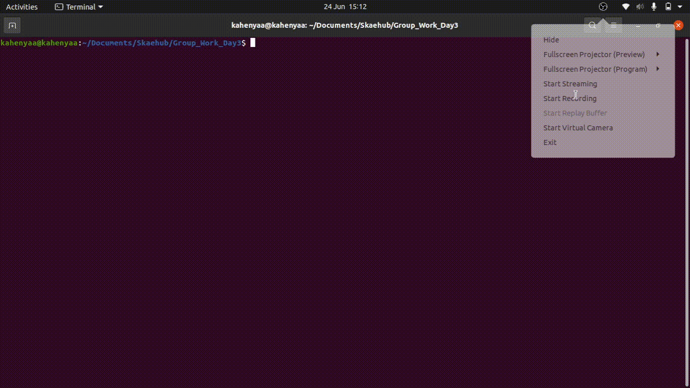
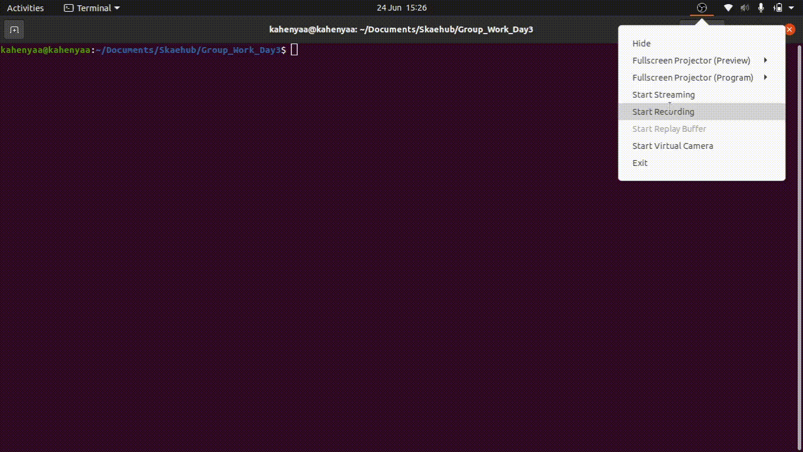

# DAY 3 CHALLENGE

# Question 1
## Tech
Here are the tools used to work on the assignment

- [Python3]
- [pandas]
- [numpy]
- [matplotlib]


## Installation
Download python3 and run the scripts

## Boot Camp Python Problems

```sh
1.Write a Python program to get the top 20 countries' data (Last Update, Country/Region, Confirmed, Deaths, Recovered) of the Novel Coronavirus (COVID-19).
```

## Development

Want to contribute? Great!
Open your favorite Terminal and run these commands.

```sh
    python3 Question1.py
```

Here is a screen recording of the solution




# Question 2

## Tech
Here are the tools used to work on the assignment

- [Python3]
- [pandas]
- [numpy]
- [matplotlib]


## Installation
Download python3 and run the scripts

## Boot Camp Python Problems

```sh
Write a Python program to create a plot (of lines) of total deaths, confirmed, recovered and active cases Country wise where deaths greater than 200.
```

## Development

Want to contribute? Great!
Open your favorite Terminal and run these commands.

```sh
    python3 Question2.py
```

Here is a screen recording of the solution


# Question 3

## Tech
Here are the tools used to work on the assignment

- [Python3]
- [pandas]
- [numpy]
- [matplotlib]


## Installation
Download python3 and run the scripts

## Boot Camp Python Problems

```sh
Write a Python program to create a plot (of lines) of total deaths, confirmed, recovered and active cases Country wise where deaths greater than 200.
```

## Development

Want to contribute? Great!
Open your favorite Terminal and run these commands.

```sh
    python3 Question3.py
```

Here is a screen recording of the solution




## License

MIT

**Free Software, **


